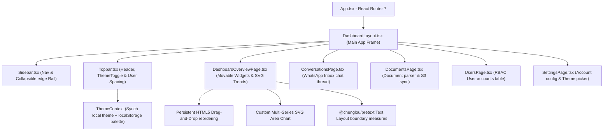

# Uchenab Dashboard — Enterprise Frontend Portal


The **Uchenab Admin Portal** is a high-performance single-page web application designed for university system administrators, agents, and staff. Built on **React 19**, **Vite**, and **TypeScript**, it incorporates a custom high-fidelity dark/light design token engine, persistent theme palette loaders, resilient JWT auth refreshes, and custom interactive visualization containers.

---

## 🏗️ Portal Structure & Layout

This map outlines how pages are routed and how state modules feed into layout panels.



---

## ✨ Key Features & UX Integrations

1. **Draggable Container Layout**: The homepage grid is modular. Drag widgets (Trends Chart, Services, Recent Documents) using the visual Grip Handles on panel headers. Order is automatically saved to `localStorage` under `uchenab-dashboard-layout` to preserve layout preferences across sessions.
2. **Interactive SVG Area Charts**: Custom, responsive SVG-based line and area charts with smooth cubic vectors, custom gradients, interactive toggles (click legend badges to show/hide lines), and a high-accuracy hovered data tooltip overlay. Uses pure CSS/SVG variables with zero heavy charting dependency footprints.
3. **Responsive Spacing Topbar**: Beautiful, breathing-room user meta column presenting the logged-in administrator name and uppercase roles with strict CSS flex gaps.
4. **Pretext Sizing**: Combines with Cheng Lou's high-speed `@chenglou/pretext` text layout calculation engine to measure titles mathematically without triggering browser layout thrashing reflows.
5. **Theme Switcher**: Integrates with custom-designed visual themes (Indigo Gold, cosmic, midnight-bloom, vercel monochrome) and a seamless transitions toggler.

---

## ⚙️ Development Operations

Ensure you have **Node.js (v18+)** installed.

### 1. Installation
Navigate to the `frontend` folder and install dependencies:
```bash
npm install
```

### 2. Configuration
Copy the environment template:
```bash
cp .env.example .env
```
Ensure `VITE_API_BASE_URL` points to the active FastAPI backend address (defaults to `http://localhost:8058`).

### 3. Local Run
Start the development server:
```bash
npm run dev
```
Open [http://localhost:5173/login](http://localhost:5173/login) in your browser.

---

## 📚 References & Developer Documentation
To deep-dive into endpoints testing strategies or to check the QA test matrices, refer to our comprehensive internal documentation:
* 📄 **[API Testing Guide](apitesting.md)**: Detailed step-by-step specifications of all REST operations, Celery hooks, auth handshakes, and postman testing guidelines.
* 📋 **[QA Test Cases Log](testcases.md)**: Fully granular testing matrices, expected assertions, input/output boundary cases, and performance criteria log.

---

## 📦 Build & Release

Verify type checks and build the production bundle:
```bash
npm run build
```
Vite outputs the optimized static assets inside the `dist/` directory, ready to be hosted on Netlify, Vercel, S3, or Nginx.
